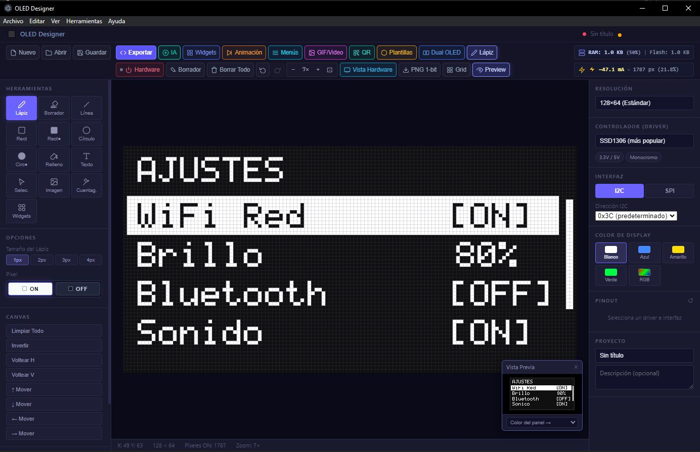

# ⚡ OLED Designer — Suite Profesional de Diseño y Emulación OLED

<p align="center">
  
</p>

[](https://nodejs.org/)
[](https://www.electronjs.org/)
[](#-licencia)
[]()

**OLED Designer** es una aplicación de escritorio integral y de alto rendimiento para diseñar, animar, simular y generar código para pantallas OLED monocromáticas y a color utilizadas en sistemas embebidos (**Arduino, ESP32, ESP8266, Raspberry Pi Pico, STM32** y más).

Combina un editor de dibujo en tiempo real, un sistema de animación por fotogramas múltiples (Timeline con Onion Skin), un generador y simulador físico de menús interactivos, un importador de GIFs con Dithering Floyd-Steinberg, un generador de códigos QR 1-bit, un catálogo de widgets paramétricos, modo de pantalla dual (Dual Screen `0x3C`/`0x3D`) y streaming en vivo por USB Serial y WiFi directamente a la pantalla real.

---

## 📑 Tabla de Contenidos
1. [Características Principales](#-características-principales)
2. [Instalación y Requisitos](#-instalación-y-requisitos)
3. [Guía de Inicio Rápido](#-guía-de-inicio-rápido)
4. [Módulos del Sistema](#-módulos-del-sistema)
   - [Editor Visual y Herramientas](#1-editor-visual-y-herramientas)
   - [Simulador de Hardware Físico](#2-simulador-de-hardware-físico)
   - [Biblioteca de Widgets e Iconos 1-Bit](#3-biblioteca-de-widgets-e-iconos-1-bit)
   - [Sistema de Animaciones y Línea de Tiempo](#4-sistema-de-animaciones-y-línea-de-tiempo)
   - [Generador y Simulador de Menús OLED](#5-generador-y-simulador-de-menús-oled)
   - [Importador de GIFs y Videos con Dithering](#6-importador-de-gifs-y-videos-con-dithering)
   - [Generador de Códigos QR 1-Bit](#7-generador-de-códigos-qr-1-bit)
   - [Biblioteca de Plantillas de Animaciones Presets](#8-biblioteca-de-plantillas-de-animaciones-presets)
   - [Modo Doble Pantalla OLED (Dual Screen)](#9-modo-doble-pantalla-oled-dual-screen)
   - [Transmisión en Vivo a Hardware Real (Live Stream)](#10-transmisión-en-vivo-a-hardware-real-live-stream)
5. [Generación de Código Multi-Plataforma](#-generación-de-código-multi-plataforma)
6. [Inteligencia Artificial Integrada](#-inteligencia-artificial-integrada)
7. [Atajos de Teclado](#-atajos-de-teclado)
8. [Estructura del Proyecto](#-estructura-del-proyecto)
9. [Base de Datos y Persistencia Local](#-base-de-datos-y-persistencia-local)

---

## 🚀 Características Principales

- **Editor 1-bit pixel-perfect**: Lienzo con zoom de 1x a 16x, centrado automático, cuadrícula configurable y soporte de resoluciones estándar y personalizadas.
- **Herramientas de dibujo completas**: Lápiz, borrador con 5 calibres y borrado rápido con clic derecho, líneas, rectángulos (huecos y rellenos), círculos, relleno por inundación (bucket) y cuentagotas.
- **Capas de texto editables**: Arrastre interactivo, alineación (izquierda, centro, derecha), tamaño en tiempo real, edición inline con doble clic y rasterizado al lienzo.
- **Exportación PNG 1-bit pura**: Codificador nativo W3C PNG monocromo de 1 bit por píxel sin compresión con pérdida.
- **Simulador físico fotorrealista**: Réplica de módulo OLED con acabado PCB personalizable (Azul, Negro mate, Púrpura ENIG), pines serigrafiados y 6 colores de display (Blanco, Azul, Amarillo, Verde, Amarillo/Azul split y RGB).
- **Línea de tiempo para animaciones**: Control cuadro a cuadro, tira de miniaturas en vivo (*Filmstrip*), papel cebolla (*Onion Skinning*), selector de 1 a 24 FPS y bucle de reproducción.
- **Biblioteca de Plantillas y Animaciones Presets**: Catálogo interactivo con más de 18 animaciones clasificadas por categoría (Juegos, Efectos FX, Relojes, Hardware, Ojos) con previsualización en vivo a FPS reales y buscador en tiempo real.
- **Generador de menús con D-Pad físico**: Simulador interactivo navegable con flechas del teclado o botones táctiles en pantalla, con soporte de opciones de acción, toggles y rangos numéricos.
- **Conversor GIF y Video a 1-bit**: Algoritmo de difusión de error Floyd-Steinberg, binarización adaptativa, auto-contraste e inyección automática en la timeline.
- **Códigos QR 1-bit integrados**: Motor Reed-Solomon autónomo y sin dependencias externas para URLs, textos y WiFi.
- **Detección Automática de Placa y Pines I2C**: Identificación inmediata de microcontroladores conectados (Arduino Mega, Uno, Nano, Leonardo, ESP32, ESP8266, RP2040) con tarjetas visuales del conexionado exacto de pines (SDA, SCL, VCC, GND).
- **Subida Directa a la Placa (1-Click Upload)**: Integración con `arduino-cli` para compilar y flashear el firmware a la placa física con un solo clic directamente desde la aplicación.
- **Streaming directo a hardware (USB Serial & WiFi)**: Transmisión en milisegundos de cada fotograma al microcontrolador real por puerto serial nativo Node.js sin bloqueos de navegador.
- **Modo Pantalla Dual**: Edición y exportación de código sincronizado para 2 pantallas OLED en simultáneo (`0x3C` y `0x3D`).
- **Generadores de código nativos**: Código C++, Python y Rust optimizado con diagramas de pines para Arduino Uno, Nano, Mega 2560, ESP32, ESP8266 y Raspberry Pi Pico.

---

## 📋 Instalación y Requisitos

### Requisitos Mínimos
| Componente | Versión Recomendada | Nota |
|---|:---:|---|
| **Sistema Operativo** | Windows 10/11, Linux (Ubuntu/Debian) | Probado en entornos x64 |
| **Node.js** | 18.0 o superior | Entorno de ejecución principal |
| **npm** | 9.0 o superior | Gestor de paquetes |
| **Git LFS** | 3.0 o superior | Necesario para descargar binarios pesados (`arduino-cli.exe`) |
| **PostgreSQL** | 13.0 o superior | *Opcional*: La app funciona 100% offline con `localStorage` si no hay base de datos instalada |

---

## ⚡ Guía de Inicio Rápido

### 1. Clonar el Repositorio (con Git LFS):
```bash
git clone https://github.com/Mijin-VT/OLED-Designer-Suite-Profesional-de-Dise-o-y-Emulaci-n-OLED.git
cd OLED-Designer-Suite-Profesional-de-Dise-o-y-Emulaci-n-OLED
git lfs pull
```

### 2. Ejecutar la Aplicación:

#### En Windows:

##### Opción A — Instalador Automatizado:
Haz doble clic en el archivo:
```bat
INSTALL.bat
```
*(Instala dependencias, configura el entorno y verifica los componentes necesarios).*

##### Opción B — Inicio Rápido:
Haz doble clic en:
```bat
INICIAR.bat
```
O para iniciar la aplicación sin ventana de terminal de fondo:
```vbs
INICIAR_OCULTO.vbs
```

##### Opción C — Desde Consola / Terminal:
```powershell
npm install
npm start
```

#### En Linux:
```bash
npm install
npm start

# Para construir el paquete instalable .deb:
python3 scripts/build_deb.py
```

---

## 🧩 Módulos del Sistema

### 1. Editor Visual y Herramientas
- **Lápiz (`P`)**: Dibujo continuo píxel a píxel con tamaños de 1px a 4px.
- **Borrador (`E`)**: Borrado multicalibre (1px, 2px, 4px, 8px, 12px) con cursor circular rojo de previsualización. También puedes borrar al instante manteniendo pulsado el **botón derecho del ratón**.
- **Figuras Geométricas**: Líneas rectas (`L`), Rectángulos huecos y rellenos (`R`), Círculos y elipses (`C`).
- **Bote de Relleno (`F`)**: Algoritmo Flood-Fill de llenado de regiones contiguas cerradas.
- **Cuentagotas (`D`)**: Muestreo rápido de color en el punto del cursor.
- **Capas de Texto Editables (`T`)**: Permite escribir textos con fuente de 5×7 px, arrastrarlos libremente por el canvas, cambiar su tamaño y alineación (izquierda, centro, derecha), editarlos con doble clic y fijarlos definitivamente al bitmap con el botón **"Fijar al Canvas"**.
- **Transformaciones de Lienzo**:
  - `Invertir`: Invierte todos los bits (0 ➔ 1, 1 ➔ 0).
  - `Voltear H / V`: Espejado horizontal y vertical del diseño.
  - `Desplazar`: Mover todo el canvas hacia Arriba, Abajo, Izquierda o Derecha.
  - `Limpiar Todo`: Vaciado completo del lienzo.
- **Exportación PNG 1-Bit**: Botón **"PNG 1-bit"** en la barra superior que genera una imagen PNG monocromática indexada (1 bit/pixel) con paleta binaria limpia para documentación, hojas de datos o impresión.

### 2. Simulador de Hardware Físico
- Modal interactivo accesible desde el botón **`Simulador`** de la barra superior.
- **Acabados de PCB**:
  - **Azul clásico**: Estilo estándar de placas Arduino/módulos comerciales.
  - **Negro mate**: Acabado profesional estilo prototipo industrial.
  - **Púrpura ENIG**: Acabado de laboratorio con contactos dorados.
- **Pines serigrafiados**: Identificación de terminales físicos: `GND`, `VCC`, `SCL`, `SDA`.
- **Efectos de Display**: Vidrio oscuro con reflejo diagonal, bisel de cristal y píxeles luminiscentes.
- **Paletas de Color OLED**:
  - Blanco puro (`#ffffff`)
  - Azul neón (`#00d4ff`)
  - Amarillo ámbar (`#ffcc00`)
  - Verde matriz (`#00ff66`)
  - Amarillo/Azul dividido (emulación exacta de displays dual split 128x64 donde las 16 filas superiores son amarillas y las 48 inferiores azules).
  - Modo RGB / Color para displays OLED compatibles con SSD1331 / SSD1351.
- **Acciones**: Botones para copiar la captura del módulo al portapapeles o descargar la foto HD en PNG.

### 3. Biblioteca de Widgets e Iconos 1-Bit (`widgets.js`)
- Accesible mediante el botón **`🧩 Widgets`** de la barra superior o pulsando la tecla **`W`**.
- **30+ Iconos Vectorizados para 1-bit**:
  - *Hardware & Batería*: Batería al 100%, 75%, 50%, 25%, Cargando ⚡, WiFi (3 niveles de señal), Bluetooth, USB.
  - *Sensores & Mediciones*: Termómetro, Gota de humedad, Sol/Luz, Rayo/Voltaje, Corazón de pulso, Velocímetro.
  - *Sistema*: Engranaje, Candado, Campana de alarma, Alerta/Warning, Checkmark OK, Cruz de error, Reloj.
  - *Navegación & Multimedia*: Flechas direccionales, Play, Pausa, Stop, Altavoz/Audio.
- **Widgets Paramétricos Pro**:
  - **Barra de Progreso**: Porcentaje deslizable (0% a 100%) con estilos *Continuo sólido* o *Segmentado (VU meter)*.
  - **Tacómetro Analógico (Gauge Dial)**: Semicírculo graduado con aguja indicadora calculada trigonométricamente en tiempo real.
  - **Barra de Estado Superior (Header Bar - 128px)**: Línea divisoria completa con indicadores integrados de WiFi y batería.
  - **Mini Gráfica Sparkline**: Gráfica senoidal continua de muestreo temporal para sensores.
  - **Tarjeta de Sensor (Metric Card)**: Cuadro delimitador con esquinas redondeadas, división de encabezado y termómetro.
- **Buscador interactivo**: Filtra por categorías (*Hardware*, *Sensores*, *Sistema*, *Navegación*, *Widgets Pro*) o por texto con previsualización pixelada y estampado directo en el centro o en las coordenadas del cursor.

### 4. Sistema de Animaciones y Línea de Tiempo
- Accesible mediante el botón **`🎬 Animación`** o el atajo **`Shift + A`**.
- **Barra de Línea de Tiempo (Timeline)**: Se despliega en la parte inferior del espacio de trabajo sin interrumpir el diseño estático.
- **Tira de Miniaturas (Filmstrip)**: Muestra en vivo cada fotograma con numeración y resalta el fotograma activo. Permite seleccionar cualquier cuadro con un solo clic.
- **Gestión Cuadro a Cuadro**:
  - `+ Frame`: Crea un fotograma en blanco.
  - `⧉ Duplicar`: Clona el fotograma actual para continuar el movimiento con precisión.
  - `🗑 Borrar`: Elimina el fotograma seleccionado (con protección de fotograma mínimo).
- **🧅 Papel Cebolla (Onion Skinning)**: Muestra el fotograma anterior con un resplandor translúcido naranja (`rgba(255, 128, 0, 0.4)`) por debajo del dibujo actual, facilitando la animación tradicional fluida.
- **Controles de Reproducción**:
  - `⏮ Primero`, `◀ Anterior`, `▶ / ⏸ Play / Pausa` (también con barra espaciadora), `Siguiente ▶`, `⏭ Último`.
  - Selector de velocidad en **FPS** (1, 2, 5, 10, 15, 20, 24 cuadros por segundo).
  - Conmutador de **🔁 Bucle continuo (Loop)**.
- **Exportación multi-fotograma**: Cuando el proyecto contiene más de 1 cuadro, los generadores de código exportan automáticamente un arreglo de punteros `PROGMEM` y un bucle cíclico en `loop()` con `delay(FRAME_DELAY_MS)` calibrado según los FPS elegidos.

### 5. Generador y Simulador de Menús OLED (`menuDesigner.js`)
- Accesible mediante el botón **`📑 Menús`** de la barra superior o pulsando la tecla **`M`**.
- **Diseño del Menú**:
  - Título de cabecera configurable con línea física de separación.
  - **4 Estilos Visuales**:
    1. *Barra Invertida*: Resaltado rectangular blanco con texto negro invertido (máxima legibilidad en SSD1306).
    2. *Flecha Cursor*: Indicador `> Opción`.
    3. *Punto Bullet*: Indicador `● Opción`.
    4. *Caja con Borde*: Marco perimetral fino alrededor del ítem activo.
  - Barra de desplazamiento lateral (*Scrollbar*) indicadora de posición.
- **Tipos de Elementos**:
  - *Acción*: Ejecución de comandos o salto de pantalla.
  - *Toggle (Interruptor)*: Alterna estados `[ON]` / `[OFF]`.
  - *Valor numérico / Rango*: Ajuste de valores (ej: `Brillo: 80%`, `Volumen: 5`) mediante flechas.
- **Simulador Interactivo de Hardware**:
  - Pantalla OLED emulada con bisel y cristal.
  - D-Pad con botones virtuales `▲`, `▼`, `◀`, `▶` y `● Enter`.
  - Navegación total por teclado: **`↑` / `↓`** para desplazarse, **`Enter`** para activar y **`←` / `→`** para modificar valores.
- **Estampado y Código**:
  - Botón **"Estampar en Canvas"**: Transfiere la vista del menú directamente al lienzo principal.
  - Generador de código C++ para Arduino con `INPUT_PULLUP`, debounce y llamadas optimizadas `drawMenu()` sin parpadeo.

### 6. Importador de GIFs y Videos con Dithering (`gifDecoder.js`)
- Accesible mediante el botón **`GIF/Video`** de la barra superior.
- **Formatos aceptados**: Archivos `.gif`, videos `.mp4`, `.webm` e imágenes estándar.
- **Motor de Conversión 1-Bit**:
  - **Dithering Floyd-Steinberg**: Difusión de error de matriz que transforma fotografías y gradientes en tramas de puntos suaves de 1 bit.
  - **Umbral de Binarización**: Slider regulable (1 a 254) con actualización en vivo.
  - **Auto-contraste**: Ecualización de histograma para resaltar detalles en pantallas de baja resolución.
  - **Invertir colores**: Convierte dibujos oscuros sobre fondo blanco a píxeles encendidos OLED.
- **Aplicar a Timeline**: Convierte toda la secuencia en fotogramas independientes y los inyecta directamente en la Línea de Tiempo.

### 7. Generador de Códigos QR 1-Bit (`qrGenerator.js`)
- Accesible mediante el botón **`QR`** de la barra superior.
- **Motor Reed-Solomon Integrado**: Codifica URLs, textos y configuraciones de red WiFi sin depender de servidores ni librerías externas.
- **Escalado Inteligente**: Permite elegir escalas 1x, 2x o 3x, incorporando la zona silenciosa (*quiet zone*) blanca obligatoria para que cualquier smartphone pueda escanear la pantalla OLED sin problemas.
- **Acciones**: Estampar en el canvas actual o agregarlo como un nuevo fotograma dentro de una animación.

### 8. Biblioteca de Plantillas y Diseños Animados (`animTemplates.js`)
- Accesible mediante el botón **`Plantillas`** de la barra superior.
- **Catálogo Enriquecido con 18+ Animaciones Listas para Cargar**:
  - **🎮 Juegos & Retro**:
    - *👾 Pac-Man Arcade*: El icónico personaje abriendo la boca y engullendo píxeles con corte angular dinámico.
    - *❤️ Latido de Corazón (Pulse)*: Latido biológico simulado con sístole y diástole de doble cámara.
    - *⚽ Pelota Rebotando (Bouncing Ball)*: Simulación elástica con cálculo de vectores de velocidad contra los bordes de la pantalla.
  - **✨ Efectos & FX**:
    - *🚀 Warp Speed (Hiperespacio 3D)*: 45 estrellas en perspectiva espacial acelerando desde el centro simulando viaje a velocidad luz.
    - *💻 Lluvia Matrix Cyberpunk*: Cascada digital descendente continua al estilo terminal hacker.
    - *🌊 Ondas de Agua (Ripple)*: Ondas concéntricas de radio expandiéndose con atenuación suave.
    - *🌧️ Lluvia Meteorológica*: Gotas de lluvia diagonales cayendo a velocidades independientes.
    - *〰️ Onda Senoidal Flotante*: Onda trigonométrica continua oscilando a lo largo del display.
  - **⌚ Relojes & Dashboards**:
    - *🕐 Reloj Digital 7-Segmentos*: Display grande estilo smartwatch con dígitos claros, segundero parpadeante y caja de fecha.
    - *🕰️ Reloj Analógico de Manecillas*: Esfera de 12 horas con marcas perimetrales y manecilla giratoria continua de 360°.
  - **🔋 Hardware, Redes & Sensores**:
    - *🔋 Carga de Batería con Rayo*: Carcasa con 5 niveles de llenado progresivo y símbolo central de recarga eléctrica.
    - *📶 Barras de Señal Móvil*: 5 barras de cobertura celular creciendo progresivamente.
    - *📈 Monitor Cardíaco ECG*: Trazo electrocardiográfico continuo con ondas P, Q, R, S, T y corazón pulsante.
    - *📡 Radar / WiFi Concéntrico*: Ondas electromagnéticas de radiofrecuencia emitiendo desde el punto emisor.
    - *🔄 Spinner Circular de Carga*: Rueda de 8 puntos rotatorios con cola degradada para pantallas de carga.
  - **🤖 Ojos & Caras**:
    - *😊 Carita Emoji Sonriente*: Rostro sonriente con parpadeo y sonrisa expresiva.
    - *🤖 Ojos Robóticos — Parpadeo*: Ojos rectangulares con esquinas redondeadas estilo Cozmo/Wall-E parpadeando suavemente.
    - *👀 Ojos Robóticos — Mirada Curiosa*: Ojos expresivos observando hacia la izquierda, centro y derecha.
- **Buscador en Tiempo Real y Filtros**: Pestañas para filtrar por categoría (*Todos*, *Ojos*, *Relojes*, *Efectos*, *Hardware*, *Juegos*) e input de búsqueda instantánea.
- **Previsualización a FPS Reales**: Cada tarjeta posee un canvas con su respectiva animación corriendo a sus cuadros por segundo reales.
- **Inyección Directa**: Al hacer clic en **"Cargar en Timeline"**, la animación sustituye los fotogramas del proyecto, ajusta los FPS ideales y permite editarlos o enviarlos a la pantalla física.

### 9. Modo Doble Pantalla OLED (Dual Screen)
- Accesible mediante el botón **`Dual OLED`** de la barra superior.
- **Control Independiente**: Diseña para dos pantallas OLED conectadas al mismo bus I2C utilizando las direcciones `0x3C` (Pantalla A) y `0x3D` (Pantalla B).
- **Alternar Lienzos**: Cambia entre la Pantalla A y B conservando bitmaps y fotogramas separados para cada una.
- **Exportación Arduino Dual**: Genera el código con dos objetos `Adafruit_SSD1306 displayA` y `displayB`, inicialización I2C a 400 kHz y actualización simultánea en el `loop()`.

### 10. Transmisión en Vivo a Hardware Real y Subida Directa (1-Click Upload)
- Accesible mediante el botón **`Hardware`** de la barra superior (con indicador LED de estado).
- **Detección Automática de Placas y Pines I2C**:
  - Escanea los puertos serie del sistema y reconoce el microcontrolador conectado.
  - Despliega una tarjeta visual interactiva con el diagrama de pines I2C específico:
    - **Arduino Mega 2560**: `SDA = Pin 20` | `SCL = Pin 21` | `VCC = 5V` | `GND = GND`
    - **Arduino Uno / Nano**: `SDA = A4` | `SCL = A5` | `VCC = 5V` | `GND = GND`
    - **Arduino Leonardo / Micro**: `SDA = Pin 2` | `SCL = Pin 3` | `VCC = 5V` | `GND = GND`
    - **ESP32 DevKit**: `SDA = GPIO 21` | `SCL = GPIO 22` | `VCC = 3.3V` | `GND = GND`
    - **ESP8266 (NodeMCU / D1 Mini)**: `SDA = D2 (GPIO 4)` | `SCL = D1 (GPIO 5)` | `VCC = 3.3V` | `GND = GND`
    - **Raspberry Pi Pico (RP2040)**: `SDA = GP4` | `SCL = GP5` | `VCC = 3.3V` | `GND = GND`
- **Subida Directa a la Placa (`⚡ Subir a la Placa`)**:
  - Botón integrado con motor de compilación y flasheo autónomo vía `arduino-cli`.
  - Libera automáticamente el puerto COM, compila el sketch receptor oficial y lo graba en la memoria flash de la placa física con un solo clic, mostrando la salida en una consola de log integrada.
- **Conexión Serial Nativa de Ultra Baja Latencia**:
  - Comunicación serie nativa en Node.js sobre Windows sin las restricciones de sandbox de WebSerial.
  - Paquetes binarios optimizados `[0xAA, 0x55, W, H, ...bytes]` a 115200 baudios.
  - **Auto-Sync en Vivo**: Cada trazo del pincel o cambio de fotograma en la timeline se reproduce en la pantalla OLED en milisegundos.
- **Streaming WiFi (ESP8266 / ESP32)**:
  - Transmisión inalámbrica de fotogramas vía sockets hacia la dirección IP asignada a la placa.
- **Sketch Receptor Oficial Inteligente**:
  - Incluye soporte para librerías `<Wire.h>`, `<SPI.h>`, `<Adafruit_GFX.h>` y `<Adafruit_SSD1306.h>`.
  - Auto-detección de pantallas con dirección `0x3C` o `0x3D` (displays clones).
  - Alerta luminosa en LED 13 si el display no responde en el bus I2C y mensaje de bienvenida gráfico en pantalla.

---

## 💻 Generación de Código Multi-Plataforma

El módulo [`src/codeGen.js`](src/codeGen.js) analiza el bitmap y genera código limpio, documentado y optimizado para las principales plataformas:

### Plataformas Soportadas:
1. **Arduino + Adafruit GFX**:
   - Inicialización completa I2C y SPI.
   - Configuración de reloj Fast I2C (`Wire.setClock(400000)`).
   - Arreglos `static const uint8_t PROGMEM oled_bitmap[]`.
   - Soporte para animaciones multi-frame con tabla de punteros y ciclo continuo en `loop()`.
   - Soporte para dos pantallas simultáneas (`0x3C` + `0x3D`).
2. **U8g2**:
   - Constructores para hardware y software I2C / SPI según el driver seleccionado.
   - Dibujo mediante `u8g2.drawXBMP()`.
3. **MicroPython**:
   - Código para Raspberry Pi Pico y ESP32 con librería `ssd1306.py`.
   - Uso de `framebuf.FrameBuffer` en modo `MONO_HLSB`.
   - Animación con bucle continuo y `time.sleep_ms()`.
4. **CircuitPython**:
   - Módulos `adafruit_ssd1306` y `adafruit_framebuf`.
5. **C Array Puro (`.h`)**:
   - Arreglos de bytes exportables directamente como archivos de cabecera para proyectos en C/C++.
6. **Rust**:
   - Código compatible con la librería `embedded-graphics` y `ImageRaw<BinaryColor>`.
7. **JavaScript / Canvas**:
   - Código HTML5 standalone para emular el display en un navegador web.

---

## 🤖 Inteligencia Artificial Integrada

OLED Designer cuenta con dos modos de generación asistida en [`src/aiModule.js`](src/aiModule.js):

1. **Motor Local Heurístico (100% Offline y Gratuito)**:
   - Analiza la densidad de píxeles y el centro de masa del diseño.
   - Detecta automáticamente regiones de texto y marcos rectangulares para sugerir llamadas vectoriales nativas (`display.println()`, `display.drawRect()`) ahorrando memoria flash en microcontroladores de baja capacidad.
   - Inserta comentarios didácticos en español y diagramas de conexión de pines según el microcontrolador.
2. **Motor Cloud OpenAI (Opcional)**:
   - Conexión con modelos LLM (`gpt-4o-mini`) definiendo la variable de entorno:
     ```powershell
     $env:OPENAI_API_KEY = "sk-..."
     ```
   - Genera sketches completos personalizados a partir de la descripción visual del diseño.

---

## ⌨️ Atajos de Teclado

| Atajo | Acción |
|---|---|
| **P** | Seleccionar herramienta **Lápiz** |
| **E** | Seleccionar herramienta **Borrador** |
| **L** | Herramienta **Línea recta** |
| **R** | Herramienta **Rectángulo** |
| **C** | Herramienta **Círculo** |
| **F** | Herramienta **Bote de Relleno** |
| **T** | Insertar o editar **Capa de Texto** |
| **D** | Herramienta **Cuentagotas** |
| **W** | Abrir biblioteca de **Widgets e Iconos** |
| **M** | Abrir **Diseñador y Simulador de Menús** |
| **Shift + A** | Desplegar / Ocultar **Línea de Tiempo (Timeline)** |
| **Espacio** | **Play / Pausa** de la animación (cuando la timeline está visible) |
| **Ctrl + Z** | Deshacer (*Undo*) |
| **Ctrl + Y** / **Ctrl + Shift + Z** | Rehacer (*Redo*) |
| **Ctrl + S** | Guardar Proyecto |
| **Ctrl + E** | Abrir modal de **Exportar Código** |
| **Ctrl + I** | Generar código asistido por **IA** |
| **Ctrl + G** | Alternar **Cuadrícula** (Grid) |
| **Ctrl + +** / **Ctrl + -** | Aumentar / Disminuir **Zoom** |
| **Ctrl + 0** | Ajustar Zoom al centro del lienzo (*Fit*) |
| **Clic Derecho** | Borrado rápido instantáneo en el lienzo |
| **Doble Clic (Texto)** | Editar texto de la capa directamente |

---

## 📁 Estructura del Proyecto

```
EMULADOR_OLED/
├── bin/                     # Binarios integrados (gestionados vía Git LFS)
│   ├── arduino-cli.exe      # Motor de compilación y flasheo para 1-Click Upload
│   └── LICENSE.txt          # Licencia GPLv3 de Arduino CLI
├── main.js                  # Proceso principal de Electron y gestión de ventanas
├── preload.js               # Puente de comunicación seguro IPC (Renderer <-> Main)
├── package.json             # Dependencias y scripts de ejecución
├── package-lock.json        # Árbol de dependencias bloqueadas
├── db.config.example.json   # Plantilla de configuración PostgreSQL
├── db.config.json           # Configuración local (ignorado en git por seguridad)
├── INSTALL.bat              # Script instalador automatizado para Windows (raíz)
├── INICIAR.bat              # Script lanzador rápido para Windows (raíz)
├── INICIAR_OCULTO.vbs       # Lanzador silencioso sin ventana de terminal
├── renderer/                # Frontend y lógica visual del cliente
│   ├── index.html           # Estructura de la interfaz de usuario y modales
│   ├── style.css            # Estilos CSS, diseño oscuro, animaciones y simuladores
│   ├── app.js               # Núcleo del editor, gestión de canvas y eventos
│   ├── widgets.js           # Catálogo de iconos 1-bit y widgets paramétricos
│   ├── menuDesigner.js      # Diseñador y simulador de menús con D-Pad
│   ├── gifDecoder.js        # Decodificador de GIFs/Video y Dithering Floyd-Steinberg
│   ├── qrGenerator.js       # Generador de códigos QR 1-bit Reed-Solomon
│   ├── animTemplates.js     # Presets de animaciones (ojos robot, ECG, loaders, radar)
│   └── liveHardware.js      # Transmisión en vivo por USB Serial y WiFi
├── src/                     # Backend Node.js de la aplicación
│   ├── codeGen.js           # Generador de código C++, Python, Rust y Dual Screen
│   ├── aiModule.js          # Análisis heurístico inteligente y soporte OpenAI
│   ├── projects.js          # Lógica CRUD de proyectos y persistencia
│   └── db.js                # Conexión resiliente a PostgreSQL (con modo offline)
├── sql/                     # Esquemas relacionales de base de datos
│   ├── Base De Datos.sql    # DDL con tablas de drivers, proyectos y versiones
│   └── base_de_datos_pg.sql # Datos iniciales con librerías y resoluciones
└── scripts/                 # Scripts de utilidad y despliegue
    ├── INSTALL.bat          # Instalador auxiliar
    ├── INICIAR.bat          # Lanzador auxiliar
    ├── INICIAR_OCULTO.vbs   # Lanzador silencioso
    ├── setup_postgres.ps1   # Configurador automatizado de PostgreSQL
    └── build_deb.py         # Constructor de paquetes .deb para Linux
```

---

## 🗄️ Base de Datos y Persistencia Local

OLED Designer implementa una arquitectura de **persistencia transparente y tolerante a fallos**:

1. **Modo Local Offline (Por defecto)**:
   - Si no tienes PostgreSQL instalado o configurado, la aplicación detecta automáticamente la ausencia del servicio y activa el **Modo Offline**.
   - Los proyectos, fotogramas y configuraciones se guardan localmente en el almacenamiento seguro de la aplicación (`localStorage` de Electron y archivos `.oled`), permitiendo trabajar sin conexión a internet ni bases de datos activas.
2. **Modo PostgreSQL (Opcional para entornos colaborativos)**:
   - Para activar la base de datos relacional completa, ejecuta PowerShell como Administrador:
     ```powershell
     powershell -ExecutionPolicy Bypass -File scripts\setup_postgres.ps1
     ```
   - Almacena historial de versiones (hasta 20 por proyecto), plantillas de drivers personalizadas y metadatos relacionales.

---

## 📄 Licencia

Este proyecto se distribuye bajo la licencia **MIT**. Eres libre de usarlo, modificarlo y distribuirlo para proyectos personales, educativos o comerciales.
